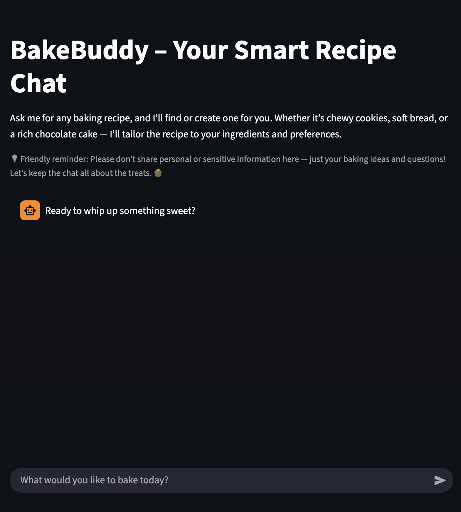
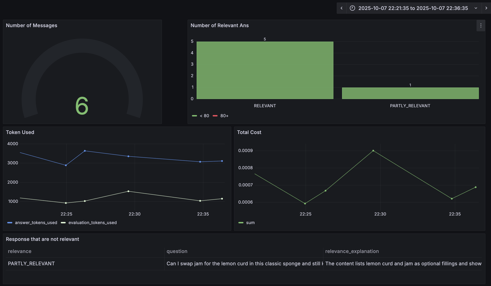

# LLMzoomcamp
# 🍰 Baking Assistant — Recipe Retrieval and Recommendation System

A **Retrieval-Augmented Generation (RAG)** application that helps users discover and generate baking recipes using natural language.  
The project integrates **semantic search**, **structured filtering**, and **LLM-based evaluation** to identify the most effective retrieval pipeline for recipe search and generation.

---

## 🚀 Project Overview

This project demonstrates an end-to-end **RAG pipeline** for structured recipe data.  
It combines **Qdrant** for vector-based retrieval, **Postgres** for metadata storage, **Streamlit** for interaction, and **Grafana** for monitoring — creating a complete experimentation and evaluation environment.

### Key Features
- 🔍 **Semantic & Hybrid Retrieval** using Qdrant + BM25  
- 🧠 **LLM Evaluation** for assessing retrieval quality and relevance  
- 📊 **Performance Monitoring** via Grafana  
- 💬 **Interactive Streamlit Chat Interface** for recipe search and feedback collection  

---

## 🧱 System Architecture


---

## 🎥 BakeBuddy Demo

Here’s a short demo of the BakeBuddy Streamlit app in action:


[](https://www.youtube.com/watch?v=b7oyp3wkDCAs)

---

## ⚙️ Installation and Setup

### 1️⃣ Clone the Repository
```bash
git clone https://github.com/wingylui/LLMzoomcamp.git
cd baking-assistant
```

### 2️⃣ Environment Variables
Create a `.env` file:
```env
POSTGRES_DB=baking_assistant
POSTGRES_USER=admin
POSTGRES_PASSWORD=password
POSTGRES_PORT=5433
QDRANT_PORT=6333
```

### 3️⃣ Build and Run with Docker Compose
```bash
docker compose up --build
```
This launches the full stack:

| Service | Description | URL |
|---------|-------------|-----|
| 🧁 Streamlit | Recipe search interface | [http://localhost:8501](http://localhost:8501) |
| 🗄️ Postgres | Structured metadata storage | localhost:5433 |
| 🧠 Qdrant | Vector similarity search | [http://localhost:6333](http://localhost:6333) |
| 📊 Grafana | Metrics and monitoring | [http://localhost:3000](http://localhost:3000) |

---

## 📂 Workflow Summary

### 1. Data Preparation
The recipe dataset was cleaned and normalized into a structured JSON format.  
Each record contains descriptive text fields (name, description, ingredients, etc.), numeric metadata (e.g., calories, time), and categorical features (e.g., difficulty, dish type).  

This structure supports both **semantic embedding** for dense retrieval and **metadata filtering** for structured queries.  
The processed dataset is stored in Postgres for efficient querying and vectorization.

---

### 2. Ground Truth Question Generation
To evaluate retrieval effectiveness, a synthetic *ground truth question set* was generated automatically using an LLM.  
For each recipe, the model produced several natural, human-like search questions that reflect realistic user intent — such as ingredient-based searches, cooking duration, or style preferences.

This question–recipe mapping became the benchmark for retrieval evaluation, allowing the system to test whether relevant recipes are correctly retrieved and ranked.

---

### 3. Retrieval Strategies
The project tests three retrieval modes:

1. **Dense Retrieval (Qdrant only)** – semantic similarity using embeddings  
2. **Hybrid Retrieval (BM25 + Dense)** – combines lexical and dense scores  
3. **Hybrid + Metadata Filter** – adds structured constraints (e.g., calories or difficulty)

Each method is evaluated to measure accuracy, precision, and retrieval ranking.

---

### 4. Retrieval Evaluation
Multiple evaluation methods were applied:

- **Hit Rate@K** – measures whether a relevant document appears within top results  
- **Mean Reciprocal Rank (MRR)** – evaluates how early relevant results appear  
- **LLM-as-a-Judge** – GPT model provides qualitative relevance grading  

#### Results Summary

| Retrieval Method | Hit Rate | MRR |
|-----------------|----------|-----|
| Dense | 0.928 | 0.823 |
| Hybrid | 0.972 | 0.855 |
| Hybrid + Filter | 0.887 | 0.738 |

#### LLM Relevance Evaluation

| Model | RELEVANT | PARTLY_RELEVANT | NON_RELEVANT |
|-------|----------|----------------|---------------|
| 5-nano | 156 | 44 | 0 |
| 5-mini | 165 | 33 | 2 |

---

## 🧁 Streamlit App
The **Streamlit interface** provides a user-friendly chat experience for recipe discovery.  
Users can:  
- Ask baking-related questions in natural language  
- Receive tailored recipe suggestions  
- Provide quick feedback (“helpful”, “not helpful”, “neutral”), which is logged for model improvement  (10% chances)



---

## 📊 Monitoring with Grafana
**Grafana** tracks and visualizes:  
- Query response latency  
- Retrieval method comparison  
- User feedback trends  
- LLM evaluation scores  

This supports transparent performance monitoring and model tuning over time.



---

## 🧩 Folder Structure
```
baking-assistant/
├── app/
│ ├── ingestion.py
│ ├── interface.py   # Streamlit / user interface
│ ├── minitor.py
│ └── rag.py
├── data/
│ ├── baking_cleaned.json
│ ├── baking.json
│ ├── GPT_5mini_evaluation.csv
│ ├── GPT_5nano_evaluation.csv
│ └── ground_truth_retrieval.csv
├── data_processing/
│ ├── data_cleaning.ipynb
│ └── evaluation_data_gen.ipynb
├── DB/
│ └── init.py
├── evaluation/
│ └── rag_evaluation.ipynb
├── grafana/
│ ├── init.py
│ └── minitor_dashboard.json
├── img/
├── Pipfile.lock
├── Dockerfile
├── docker-compose.yaml
├── .gitignore
└── README.md
```


---
## 🧪 Future Work
- Add **active learning loop** to retrain retrieval embeddings from user feedback  
- Incorporate **re-ranking models** for hybrid search optimization  


